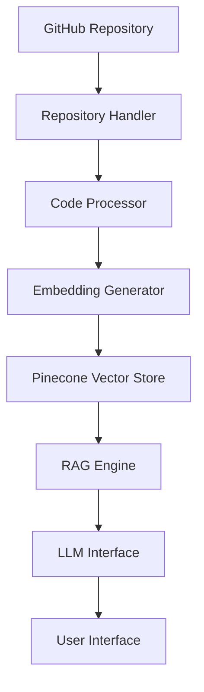

<div align="center">

# 🤖 CodeChat AI


[](https://github.com/sheick/codechat-ai/blob/main/LICENSE)
[](https://www.python.org/downloads/)
[](https://streamlit.io)
[](https://github.com/psf/black)

_Your AI-Powered Code Companion for Intelligent Repository Analysis_

[Demo](https://codechat-ai.demo.com) • [Documentation](https://docs.codechat-ai.com) • [Report Bug](https://github.com/sheick/codechat-ai/issues) • [Request Feature](https://github.com/sheick/codechat-ai/issues)

</div>

---

## 🎯 Overview

CodeChat AI revolutionizes code understanding by combining the power of RAG (Retrieval-Augmented Generation) with advanced language models. It enables developers to have meaningful conversations about their codebase while maintaining deep context across multiple repositories.

<div align="center">

</div>

## ✨ Key Features

🔄 **Smart Repository Integration**

- Seamless GitHub repository connection
- Automatic code analysis and indexing
- Support for multiple programming languages

🧠 **Advanced Context Understanding**

- RAG-powered code comprehension
- Maintains context across conversations
- Deep understanding of code structure

🤖 **Multi-Model AI Support**

- Google Gemini integration
- Extensible model architecture
- Optimized for code understanding

💬 **Interactive Development Experience**

- Natural language code queries
- Contextual code suggestions
- Real-time response generation

## 🚀 Getting Started

### Prerequisites

Before you begin, ensure you have:

- Python 3.8 or higher

### ⚡ Quick Install

1. **Clone & Setup**

```bash
# Clone the repository
git clone https://github.com/sheicky/codechat-ai.git
cd codechat-ai

# Create and activate virtual environment
python -m venv venv
source venv/bin/activate  # Unix/macOS
# or
.\venv\Scripts\activate  # Windows
```

2. **Install Dependencies**

```bash
pip install -r requirements.txt
```

3. **Configure Environment**

```bash
# Create .env file
cp .env.example .env

# Add your API keys to .env
PINECONE_API_KEY=your_pinecone_key
GOOGLE_API_KEY=your_google_key
GITHUB_TOKEN=your_github_token
```

4. **Launch Application**

```bash
streamlit run rag_app.py
```

## 🏗️ Architecture



## 🛠️ Technology Stack

| Category            | Technologies                                                                                                                                                               |
| ------------------- | -------------------------------------------------------------------------------------------------------------------------------------------------------------------------- |
| **Frontend**        |                                                                       |
| **Backend**         |                                                                                |
| **AI/ML**           |   |
| **Vector Store**    |                                                                                                        |
| **Version Control** |                                                                                         |

## 📈 Performance

- **Frontend**: Streamlit
- **Embeddings**: Sentence Transformers
- **Vector Store**: Pinecone
- **LLM**: Google Gemini
- **Code Processing**: LangChain
- **Version Control**: Git


```bash
# Development workflow
git checkout -b feature/amazing-feature
git commit -m 'feat: add amazing feature'
git push origin feature/amazing-feature
```


## 👏 Acknowledgments

- [LangChain](https://github.com/hwchase17/langchain) for RAG implementation
- [Pinecone](https://www.pinecone.io/) for vector storage
- [Google Gemini](https://deepmind.google/technologies/gemini/) for AI capabilities
- [Streamlit](https://streamlit.io/) for the UI framework

## 📬 Contact & Support

- LinkedIn: [Sheick](https://www.linkedin.com/in/pensas/)

<div align="center">

Made with ❤️ by Sheick | Copyright © 2024

</div>
